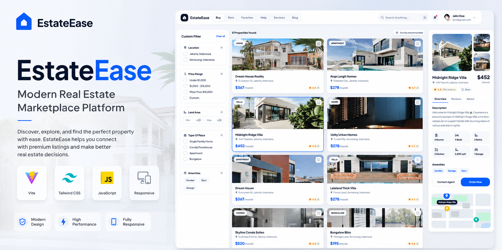
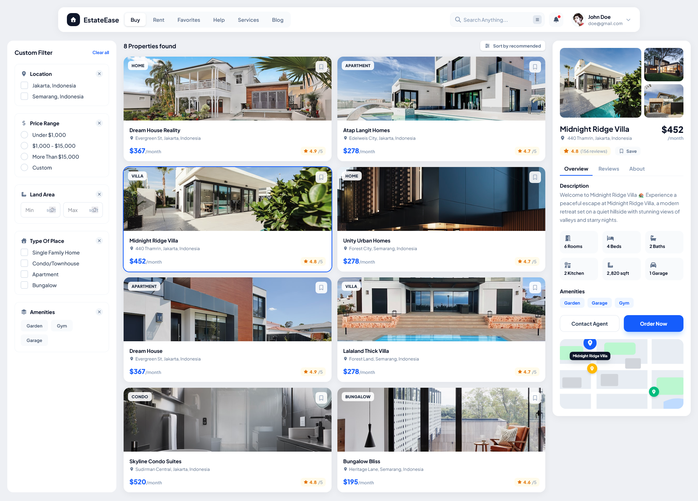
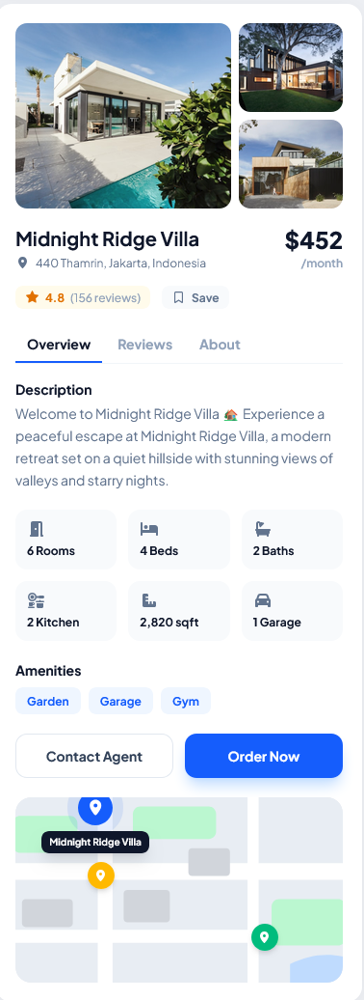
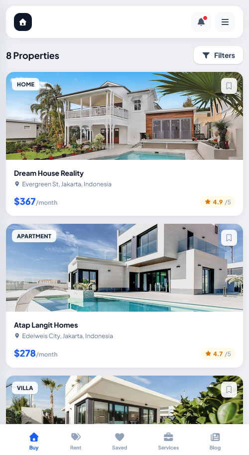

# EstateEase

Modern Real Estate Marketplace Platform

## Live Demo

https://estate.paarlastudio.com

## Overview

EstateEase is a modern real estate marketplace platform designed to simplify property discovery and browsing.

The platform provides an intuitive user experience for exploring properties, viewing detailed listings, searching by location, and discovering real estate opportunities through a clean and responsive interface.

Built using modern frontend technologies, EstateEase focuses on performance, accessibility, and seamless user interaction across all devices.

---

## Features

### Property Discovery

* Featured Properties
* Property Categories
* Advanced Search Interface
* Property Details
* Location Information
* Responsive Property Grid

### User Experience

* Responsive Design
* Mobile Optimized Layout
* Fast Navigation
* Modern UI Components
* Interactive Elements

### Technical Features

* Component Based Structure
* Optimized Performance
* SEO Friendly Markup
* Scalable Frontend Architecture
* Cross Browser Compatibility

---

## Tech Stack

* Vite
* Tailwind CSS
* JavaScript (ES6+)
* Responsive Design

---

## Screenshots

### Homepage

### Property Details

### Mobile View

---

## Performance

EstateEase was designed with a focus on:

* Fast Loading
* Smooth User Experience
* Mobile First Design
* Scalable Architecture

---

## Future Enhancements

* Property Filtering
* Favorites System
* Interactive Maps
* Property Comparison
* User Authentication
* Agent Dashboard

---

## Author

GitHub:
https://github.com/alirezahosseini

Portfolio:
https://elham.paarlastudio.com
